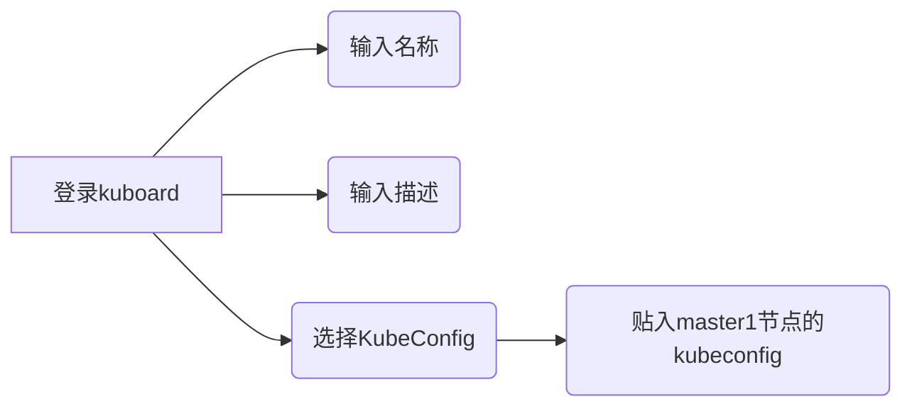

## kuboard可视化配置

登录kuboard

打开浏览器使用master1节点ip+32766登录 kuboard web页面,[查看kuboard默认密码](./admin.md)

              

```mermaid
graph LR
A[登录kuboard] -->B(输入名称)
    A -->C(输入描述)
    A -->D(选择KubeConfig)
    D -->E(贴入master1节点的kubeconfig)
```