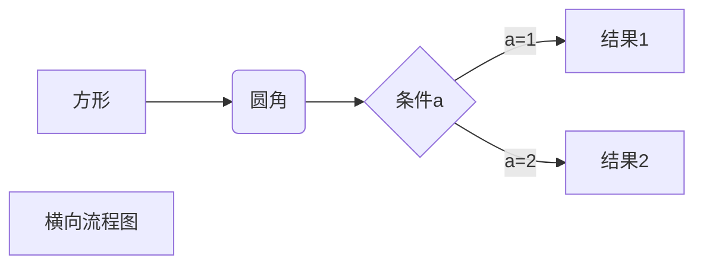

## kuboard可视化配置

登录kuboard

打开浏览器使用master1节点 ip+30766 登录 kuboard web页面,[点击查看kuboard默认登录密码](./admin.md)

              
点击添加集群————>输入

```mermaid
graph LR
A[方形] -->B(圆角)
    B --> C{条件a}
    C -->|a=1| D[结果1]
    C -->|a=2| E[结果2]
    F[横向流程图]
```