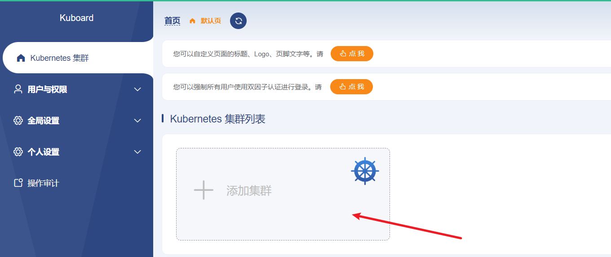

## kuboard可视化配置

登录kuboard

打开浏览器使用master1节点ip+32766登录 kuboard web页面,[查看kuboard默认密码](./admin.md)

              

kubeconfig可以在任意master节点的cat ~/.kube/config中查看

然后点击确定

选择管理员身份，点击集群概要

然后查看具体的命名空间，进行操作

