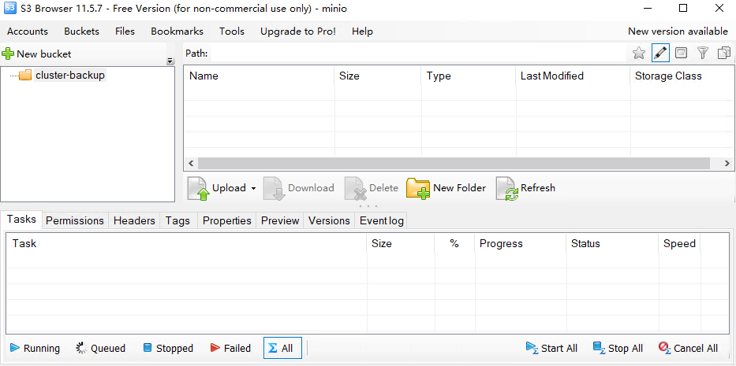
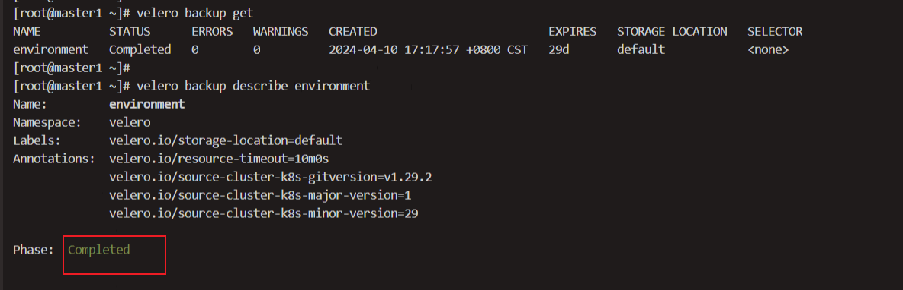

## 单节单硬盘

### 条件

- 使用 XFS 格式化

- 为了确保在节点重启后驱动器到挂载点的映射一致，请使用/etc/fstab文件

- master节点有另外的数据盘

- 操作在master节点上执行


假设存储盘挂载到了/minio

```bash
#确认存储的挂载位置,修改minio_datadir
vi script/k8s/minio-install.sh
```

**安装之后会console占用9001端口，api端口为9000**

通过浏览器测试对象存储的web访问:    http://${my_ip}:9001


通过s3browser测试对象存储的api访问: http://${my_ip}:9000




mc的命令行操作
```bash
mc config host add cluster_backup http://${my_ip}:9000 admin dy3cZFzhHKrdWk1yt
mc config  host list

#查看bucket
mc ls cluster_backup
#创建bucket
mc mb cluster_backup/cluster-backup

# 上传一个文件到bucket中
mc cp /etc/hosts cluster_backup/cluster-backup
# 上传一个目录到bucket中
mc cp /etc cluster_backup/cluster-backup --recursive

# 删除文件
mc rm cluster_backup/cluster-backup/hosts
# 删除目录
mc rm cluster_backup/cluster-backup/etc --recursive --force

# 删除 没有文件的bucket
mc rb cluster_backup/cluster-backup
# 删除 有文件的bucket
mc rb cluster_backup/cluster-backup --force
```


### 配置集群备份

```bash
配置命令行自动补全
velero completion  bash >/etc/profile.d/velero
source /etc/profile.d/velero
```

```bash
cat > credentials-velero <<EOF
[default]
aws_access_key_id = admin
aws_secret_access_key = dy3cZFzhHKrdWk1yt
EOF
```

```bash
#需要外网拉取镜像
docker.io/velero/velero-plugin-for-aws:v1.9.1
docker.io/velero/velero:v1.13.1
#不同k8s集群版本需要修改，详情见官网

velero install \
  --provider aws \
  --image velero/velero:v1.13.1 \
  --plugins velero/velero-plugin-for-aws:v1.9.1 \
  --bucket cluster-backup \
  --secret-file ./credentials-velero \
  --use-node-agent \
  --use-volume-snapshots=false \
  --namespace velero \
  --backup-location-config region=minio,s3ForcePathStyle="true",s3Url=http://${my_ip}:9000 \
  --wait
```

一次性备份

```bash
#备份整个命名空间
velero backup create environment --include-namespaces=environment
velero backup create eworldcloud --include-namespaces=eworldcloud
#STATUS 显示为 Completed 代表备份成功
velero backup get
velero backup describe environment
velero backup logs environment
```


```bash
#查看备份文件
mc ls cluster_backup/cluster-backup/backups/environment
```

定时备份

```bash
# 使用cron表达式备份,例如每月的1号0点0分0秒备份
velero schedule create environment --schedule="0 0 1 * *" --include-namespaces environment
velero schedule create eworldcloud --schedule="0 0 1 * *" --include-namespaces eworldcloud
# 使用一些非标准的速记 cron 表达式，例如每天备份
velero schedule create environment --schedule="@daily" --include-namespaces environment
# 手动触发定时任务
velero backup create --from-schedule environment


velero schedule get
velero schedule describe environment
#暂停定时任务
velero schedule pause environment
#恢复定时任务
velero schedule unpause environment
```
----------------------------------------------------------------------------
*引用*

https://velero.io/docs/main/contributions/minio/